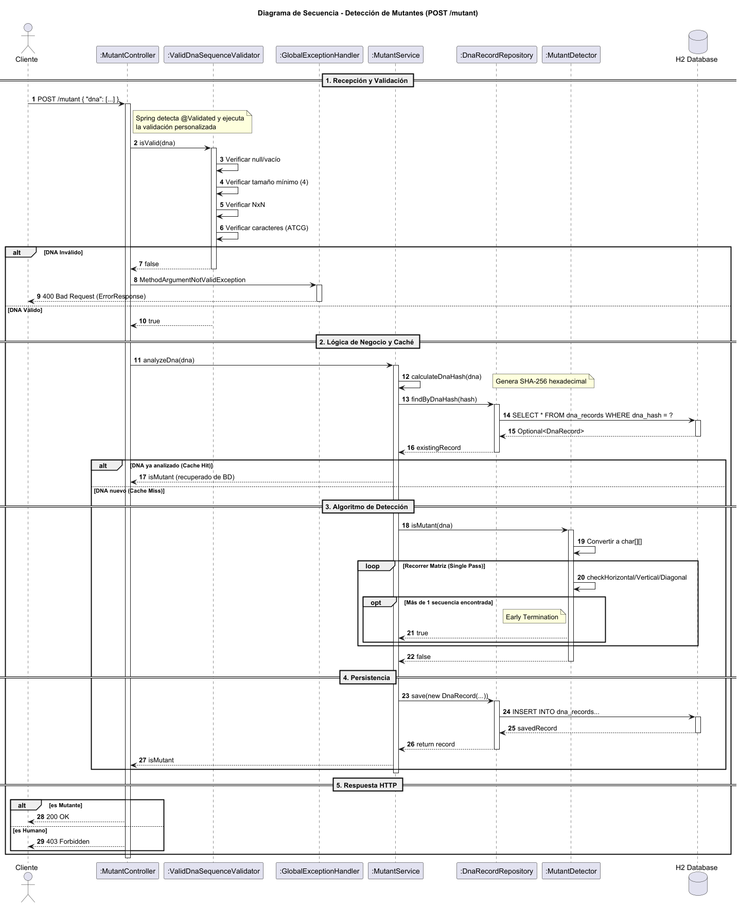

---
## 📊 Diagramas

### Diagrama de Secuencia

El siguiente diagrama muestra el flujo completo de ejecución de la API REST Detector de Mutantes:

#### Componentes del Diagrama

| Componente | Tipo | Descripción |
|------------|------|-------------|
| **Usuario** | Actor | Cliente que consume la API |
| **MutantController** | Controller | Capa de presentación REST |
| **ValidDnaSequenceValidator** | Validator | Validación de entrada (@Valid) |
| **GlobalExceptionHandler** | Exception Handler | Manejo centralizado de errores |
| **MutantService** | Service | Orquestación y lógica de negocio |
| **MutantDetector** | Service | Algoritmo core de detección |
| **DnaRecordRepository** | Repository | Acceso a datos (Spring Data JPA) |
| **StatsService** | Service | Cálculo de estadísticas |
| **H2 Database** | Database | Persistencia de datos |

#### Flujos Principales

1. **POST /mutant - Verificar ADN Mutante**
   - Validación de entrada con `@ValidDnaSequence`
   - Cálculo de hash SHA-256 para deduplicación
   - Búsqueda en caché (base de datos)
   - Algoritmo de detección (4 direcciones)
   - Early Termination cuando se encuentran >1 secuencias
   - Persistencia del resultado

2. **GET /stats - Obtener Estadísticas**
   - Consulta de contadores en base de datos
   - Cálculo del ratio mutantes/humanos
   - Respuesta JSON con estadísticas

3. **Manejo de Excepciones**
   - Validación: HTTP 400 Bad Request
   - Errores de sistema: HTTP 500 Internal Server Error

**Archivo fuente:** [diagrama-secuencia.puml](diagrama-secuencia.puml)